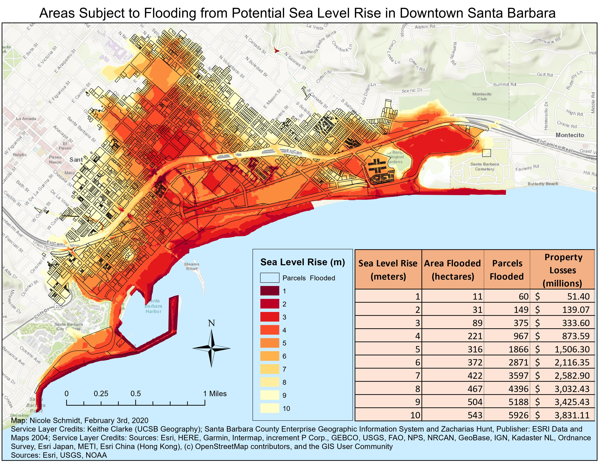

```{r setup, include=FALSE}
knitr::opts_chunk$set(echo = FALSE)

library(tidyverse)
library(pdftools)

```

#### Summary
I conducted a spatial analysis in ArcGIS to identify areas most at risk of flooding due to sea level rise in downtown Santa Barbara. I identified the areas projected to be flooded, parcels projected to be flooded, and estimated the cost of property loss based of data from the National Oceanic and Atmospheric Administration and the United States Geological Survey.


