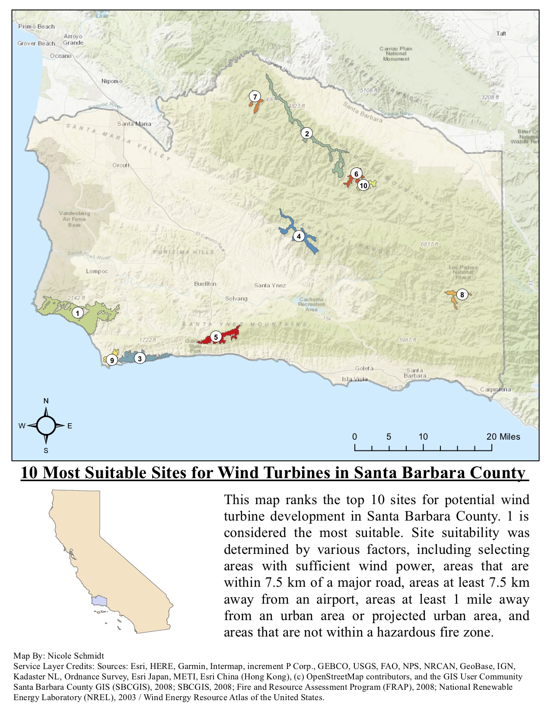

```{r setup, include=FALSE}
knitr::opts_chunk$set(echo = FALSE)

library(tidyverse)
library(pdftools)

```

#### Summary
I conducted a spatial analysis in ArcGIS  to find the top 10 most suitable areas in the county of Santa Barbara for wind turbines. The suitability of sites was based on various factors:

- Sites must be in areas with sufficient wind energy 
- Sites must be within 7.5 km of a major road
- Sites must not be within 1 mile of an existing urban area
- Sites cannot be within 7.5 km of a major airport
- Sites cannot be within a fire hazard zone
- Sites cannot be on public lands




